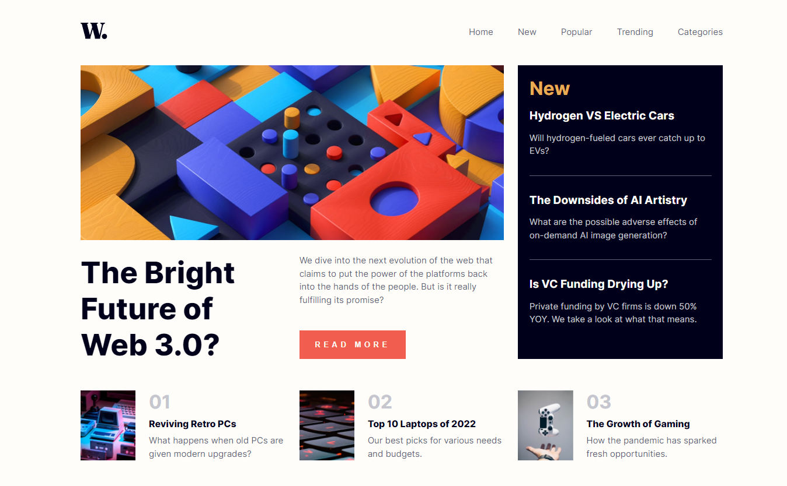
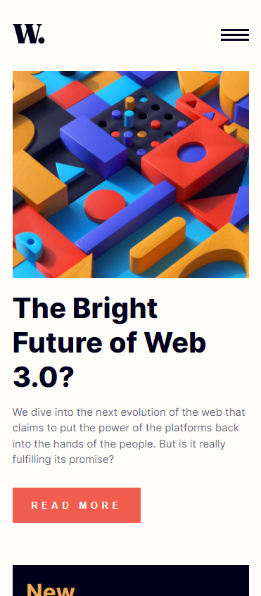

# Frontend Mentor - News homepage solution

This is a solution to the [News homepage challenge on Frontend Mentor](https://www.frontendmentor.io/challenges/news-homepage-H6SWTa1MFl). Frontend Mentor challenges help you improve your coding skills by building realistic projects. 

## Table of contents

- [Overview](#overview)
  - [The challenge](#the-challenge)
  - [Screenshot](#screenshot)
- [My process](#my-process)
  - [Built with](#built-with)
  - [What I learned](#what-i-learned)

## Overview

### The challenge

Users should be able to:

- View the optimal layout for the interface depending on their device's screen size
- See hover and focus states for all interactive elements on the page

### Screenshot




## My process

### Built with

- Semantic HTML5 markup
- CSS custom properties
- SASS
- Flexbox
- CSS Grid
- Mobile-first workflow

### What I learned

While creating this project, I tested two possible ways to design this layout - flexbox and grid. 
To make it possible, I created a separate branch for each method.

I've also learned how to build a responsive website using mobile-first workflow. 
I used sass- CSS preprocessor that allows you to create style sheets faster and much more clearly. 

Some code examples:

```scss
nav{
    position: fixed;
    right: 0;
    top: 0;
    background: var(--Off_white);
    height: 100vh;
    width: 68%;
    z-index: 2;

    transform: translateX(100%);
    transition: transform .5s ease-in-out;
    ul {
        list-style-type: none;
        padding: 0;
        margin-top: 8em;
    
        a {
            color: var(--Very_dark_blue);
            padding: .75em 2em;
            display: block;
            width: 100%;
    
            &:hover {
                color: var(--soft_orange);
            }
        }
    }
    .close{
        width: 32px;
        height: 31px;
        float: right;
        margin: 1.6em;
    }
}
```
